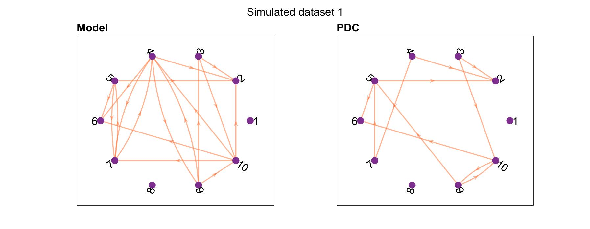

### SEED-G: Simulated EEG Data Generator for testing connectivity algorithms
SEED-G toolbox was developed in MATLAB environment and is publicly availa-ble at https://github.com/aanzolin/SEED-G-toolbox .

In the proposed toolbox, the generation of pseudo-EEG data that reproduce well-known ground-truth networks is performed using 
multivariate autoregressive (MVAR) models as a generator filter to provide a benchmark for functional connectivity estimates. 
**Figure 1** synthesizes the simulated EEG data generation process, including the definition of the ground-truth and the generation 
of the time series.

 

Figure 1

### 1.Ground-truth model generation.

If not provided by the user, the toolbox first generates a ground-truth connectivity model which is then used as matrix of coefficients in the MVAR model. Alternatively, the user can provide the model as input. Ground-truth connectivity model consists in a weighted directed 3D matrix of dimensions equal to NxNxp where N is equal to the number of nodes and p is equal to the MVAR model order. The matrix is created by imposing the non-null connections (whose number can be chosen by the user) equal to a value randomly selected within a specific range (chosen by the user). This value is imposed only at one lag among the possible p lags, randomly selected. The null connections are instead characterized by null coefficients at each lag among the possible ones. In order to obtain simulated signals that reproduce the spectral properties of EEG data, the user could include real sources in the model (see folder real data). In particular, the function can include in the main diagonal of the ground-truth model AR components extracted from real signals. 
	
  * Function: `get_ConnectivityModel.m`
  * Parameters to be set: the number of signals N to be generated, the amount of non-null connections imposed in the ground-truth network (density), the number of real sources included in the model. When nodes in the network are not directly nor indirectly linked to one of the EEG sources (isolated nodes), the corresponding signals are replaced with real EEG sources (AR_choice = 1). 

### 2.Time series generation.

After the ground-truth network generation, a MVAR-based generator filter creates the dataset of timeseries. The MVAR model uses uncorrelated, zero mean innovation noise simulated through a normally distributed pseudorandom generator. The covariance of the innovation process is set equal to the identity matrix. 

* Functions: `simulatedData_generation.m` `run_generation.m`
* Parameters to be set: 
  * number of data samples for each realization
  * number of realizations to be generated (trials)
  * signal-to-noise ratio (noise-free signals could be generated by setting SNR = Inf)

### S1. Inter-trial variability in the connectivity pattern

In the case of multi-trial dataset, the inter-trial variability typical of real data can be modeled in the ground-truth. The SEED-G toolbox models two kinds of non-idealities across trials: i) variability of the intensity of existing connections hypothesizing that connections values are not consistent across repetitions and ii) variability in network density in order to account for the presence of spurious connections in some trials.

* Functions: `get_ConnectivityModel_withITV.m` `simulatedData_generation_intertrial_var.m` `run_generation_intertrial_variability.m`
* Parameters to be set: 
  * percentage of altered trials
  * number of connections to be modified in weight
  * entity (percentage with respect to original weight) and the direction (increase or decrease with respect to the original weight) of the variation
  * number of spurious links added to the original model in specific trials.

### S2. Time-varying connectivity

SEED-G toolbox permits the generation of stationary or time-varying connectivity ground-truths. The generation process is the same, but in the dynamic case, a different connectivity model is imposed for each time point. 

* Functions: `genvar_timevarying.m` `get_time_varying_ConnectivityModel.m` `simulatedData_generation_time_varying_connectivity.m` `run_generation_time_varying_connectivity.m`
* Parameters to be set: 
  * type of transition (step/ramp)
  * percentage of connections varying across time
  * magnitude of the connectivity weight variations expressed as percentage of the pre-transition value.

### S3. Volume conduction

Depending on the type of real sources used for the signal generation, SEED-G can simulate both scalp and cortical data. If cortical signal are simulated, they can be projected on the scalp in order to obtain pseudo-EEG signals with the realistic effect of the volume conduction.
* Functions: `simulatedData_generation_with_volume_conduction.m` `run_generation_with_volume_conduction.m` 
* Parameters to be set: 
  * ROIs lables (e.g. 'Brodmann area 19_L' 'Brodmann area 19_R')
  * Sensors labels (e.g. 'C3' 'C4' 'CP1' 'CP2')

### Dependencies

The functions from the following tools, relevant for SEED-G have been included in this repository:

* Brain Connectivity Toolbox (BCT) [1]. The full package is available at: https://sites.google.com/site/bctnet/  
* FiedTrip [2]. The full package is available at https://www.fieldtriptoolbox.org/download/ 
* Multi-Variate Granger Causality Toolbox (MVGC) [3]. The full package is available at https://users.sussex.ac.uk/~lionelb/MVGC/html/mvgchelp.html 
* New York Head model: the forward model included in the toolbox and available on the ICBM-NY platform [4].
* AsympPDC Package. The full package is available at: https://www.lcs.poli.usp.br/~baccala/pdc/CRCBrainConnectivity/AsympPDC/ [5].

### Demo

This folder contains MATLAB scripts to run the functions in the `main` repository. 
`run_generation.m`, `run_generation_intertrial_variability.m`, `run_generation_time_varying_connectivity.m`, `run_generation_with_volume_conduction.m` are examples of framework to run (respectively) the functions `simulatedData_generation.m`, `simulatedData_generation_intertrial_var.m`, `simulatedData_generation_time_varying_connectivity.m` `simulatedData_generation_with_volume_conduction`.

## PDC application

`run_compute_pdc_on_simulated_data` compute the PDC estimation on three generated datasets with similar caracteristics, except for the lenght of the signals. 

In particular, for all of them we imposed the following parameters

* number of time series = 10
* number of trials = 1
* data type = scalp
* SNR = 10
* density of the imposed network = 20%

while the number of samples was:

* 500 for sim_dataset_1
* 1500 for sim_dataset_2
* 2500 for sim_dataset_3.

The three generated datasets used in this example are in the folder '\SEED-G toolbox\demo\PDC application\simulated data'.

The results of this basic example showed how higher number of samples available for the connectivity estimation led to better performace in terms of false positive and false negative. In Figure 2-4 we reported the imposed model and the PDC estimates in each of the three simulated cases. 

# Case 1: 500 samples

FPR = 2%

FNR = 50%

 SEED-G-toolbox/demo/PDC application/results/

### References 

[1]	M. Rubinov and O. Sporns, “Complex network measures of brain connectivity: Uses and interpretations,” NeuroImage, vol. 52, no. 3, pp. 1059–1069, Sep. 2010, doi: 10.1016/j.neuroimage.2009.10.003.

[2]	R. Oostenveld, P. Fries, E. Maris, and J.-M. Schoffelen, “FieldTrip: Open Source Software for Advanced Analysis of MEG, EEG, and Invasive Electrophysiological Data,” Comput. Intell. Neurosci., vol. 2011, p. e156869, Dec. 2010, doi: 10.1155/2011/156869.

[3]	L. Barnett and A. K. Seth, “The MVGC multivariate Granger causality toolbox: a new approach to Granger-causal inference,” J. Neurosci. Methods, vol. 223, pp. 50–68, Feb. 2014, doi: 10.1016/j.jneumeth.2013.10.018.

[4]	Y. Huang, L. C. Parra, and S. Haufe, “The New York Head—A precise standardized volume conductor model for EEG source localization and tES targeting,” NeuroImage, vol. 140, pp. 150–162, Oct. 2016, doi: 10.1016/j.neuroimage.2015.12.019.

[5]	L. A. Baccal´a and K. Sameshima. Partial directed coherence: a new concept in neural structure determination. Biological Cybernetics, 84:463–74, 2001a.

